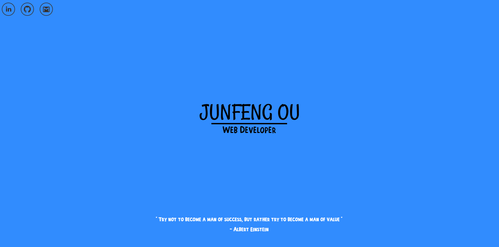

<h1 align="center">
  My Portfolio version 2
</h1>

<p align="center">
    The second iteration of my personal portfolio, built with Gatsby and hosted on Netlify.
</p>



## To run it locally on your PC

1. Download the file

2. Install required dependencies

   ```sh
   npm install
   ```

3. Start the development server

   ```sh
   npm start
   ```

4. Master is now locked

   ```sh
   To change this, go to -> Settings -> Branches -> Branch Protection Rules
   ```
